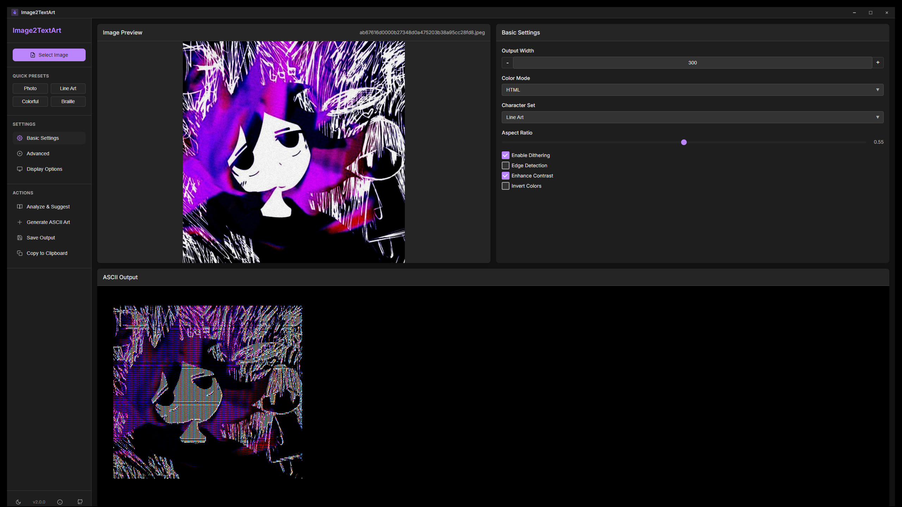

# Image2TextArt

## Overview

Image2TextArt is a powerful tool that transforms images into beautiful and highly detailed ASCII art. It supports multiple rendering modes, each optimized for maximum detail and precision. The tool features both a command-line interface and an enhanced graphical user interface with advanced customization options.

## Features

- **High-detail conversion** in all modes:
  - **Grayscale**: Rich tonal variation with optimized character mapping
  - **ANSI 256-color**: Detailed color representation with optimized palette
  - **Truecolor**: Full 24-bit color with precise character selection
  - **HTML**: Web-friendly colorized output with custom styling
  - **Unicode Braille**: High resolution dot-pattern representation
  
- **Intelligent image processing**:
  - Advanced detail enhancement with local contrast optimization
  - High-quality dithering with mode-specific algorithms
  - Sophisticated edge detection and enhancement
  - Adaptive threshold calculation
  - Dynamic character mapping based on visual density
  
- **Expanded character sets**:
  - 13+ optimized character presets for different visual styles
  - Dense gradient sets for smooth transitions
  - Specialized sets for photos, line art, geometric patterns, and more
  - Custom character set support
  
- **Enhanced GUI**:
  - Auto-fit feature that adjusts to window size
  - Image analysis with recommended settings
  - Advanced display options with zoom controls
  - Font size and family selection
  - Custom background and foreground colors
  - Settings persistence between sessions
  
- **Advanced customization**:
  - Brightness, contrast, and saturation controls
  - Gamma correction and detail level adjustment
  - Blur and sharpen filters
  - Aspect ratio fine-tuning
  - Edge threshold control

- **Performance optimizations**:
  - Efficient memory usage for large images
  - Multithreaded processing in GUI
  - Caching for repeated operations
  - Automatic setting recommendations
  - Optimized character density mapping

## Recent Updates

- Added large image optimization for memory efficiency
- Improved processing speed with optimized algorithms
- Enhanced multithreaded support in GUI application
- Added auto settings feature for optimal results
- Optimized Electron GUI for better performance
- Fixed output display scaling in auto-fit mode

## Installation

### Prerequisites

- Python 3.7 or later
- `pip` package manager

### Install Required Dependencies

Clone the repository and install the required dependencies:

```sh
git clone https://github.com/renbkna/Image2TextArt
cd Image2TextArt
pip install -r requirements.txt
```

### Optional: Install in Editable Mode

For convenient command-line entry points:

```sh
pip install -e .
```

This registers the entry points defined in `setup.py`, allowing you to run the app with commands like `Image2TextArt-gui`.

## Usage

### CLI Mode

#### Basic Usage

To generate ASCII art from an image using the command-line interface, run:

```sh
python -m image2textart_generator.cli /path/to/image.jpg
```

Or if installed:

```sh
Image2TextArt /path/to/image.jpg
```

#### Options

| Option             | Short | Description                                              |
| ------------------ | ----- | -------------------------------------------------------- |
| `--width`          | `-w`  | Set output width (default: 100)                          |
| `--color`          | `-c`  | Color mode: grayscale, ansi, truecolor, html, braille   |
| `--dither`         | `-d`  | Enable dithering                                         |
| `--edges`          | `-e`  | Enable edge detection                                    |
| `--preset`         | `-p`  | Choose character set preset                              |
| `--output`         | `-o`  | Save output to a file                                    |
| `--no-enhance`     |       | Disable auto contrast enhancement                        |
| `--edge-threshold` |       | Set edge detection threshold (0-255)                     |
| `--invert`         |       | Invert image colors                                      |
| `--aspect-ratio`   |       | Adjust aspect ratio correction                           |
| `--blur`           |       | Apply blur (0.0-10.0)                                    |
| `--sharpen`        |       | Apply sharpening (0.0-10.0)                             |
| `--brightness`     |       | Adjust brightness (0.5-2.0)                              |
| `--saturation`     |       | Adjust saturation (0.0-2.0)                              |
| `--custom-chars`   |       | Specify custom character set                             |
| `--optimize-for`   |       | Optimization preference (quality, speed, memory)         |
| `--max-image-size` |       | Maximum image dimension before downscaling               |
| `--auto-settings`  |       | Automatically determine optimal settings for the image   |

#### Example Usage

Convert an image to grayscale ASCII art with enhanced detail:

```sh
Image2TextArt /path/to/image.jpg -c grayscale --sharpen 2.0 --contrast 1.2
```

Create Braille art with dithering:

```sh
Image2TextArt /path/to/image.jpg -c braille -d -w 120
```

Use edge detection with custom threshold:

```sh
Image2TextArt /path/to/image.jpg -e --edge-threshold 50
```

Use automatic settings optimization:

```sh
Image2TextArt /path/to/image.jpg --auto-settings
```

### GUI Mode

#### Launch GUI

To run the enhanced graphical user interface, execute:

```sh
python -m image2textart_generator.gui
```

If you've installed in editable mode, you can also launch it using:

```sh
Image2TextArt-gui
```

#### GUI Features

The GUI provides access to all features through an intuitive interface:

- **Basic tab**: Width, color mode, character set, aspect ratio, and basic toggles
- **Advanced tab**: Fine-tuning controls for edge threshold, blur, sharpen, brightness, saturation, contrast, detail level, gamma, and custom character sets
- **Display tab**: Font controls, auto-fit toggle, and zoom buttons
- **Color controls**: Custom background and foreground colors
- **Recommended settings**: Automatic analysis of the image to suggest optimal settings
- **Large image handling**: Optimized processing for large images to prevent memory issues

## Character Sets

The generator includes numerous character sets optimized for different purposes:

- `block`: Block characters for solid shapes
- `dense`: Smooth gradient transitions
- `lineart`: Line-drawing characters for diagrams
- `classic`: Traditional ASCII art characters
- `unicode`: Unicode block characters
- `detailed`: Extensive gradient for photographic detail
- `binary`: Simple high-contrast (just 0 and 1)
- `minimal`: Clean, simple gradient
- `circles`: Circle-based characters for organic shapes
- `shading`: Pure shading blocks
- `geometric`: Geometric shapes
- `dots`: Braille-like patterns
- `contrast`: High contrast (space and full block)
- `photo`: Optimized for photographs
- `pixel`: Retro-style pixelated look
- `ultra`: Maximum detail character set

## Electron GUI

The project also includes an Electron-based GUI for a native desktop experience:



### Features of the Electron GUI

- Modern, responsive interface with dark/light theme support
- Live preview of settings changes
- Full access to all generation options
- Settings persistence between sessions
- Custom window controls and layout
- Hardware-accelerated rendering
- Memory optimization for large images
- Result caching for improved performance

### Running the Electron GUI

```sh
cd electron-gui
npm install
npm start
```

## Performance Optimization

Image2TextArt includes several optimizations for better performance:

- **Memory-efficient image processing**: Large images are automatically scaled down to prevent memory issues
- **Optimized character mapping**: Efficient algorithm for mapping brightness to characters
- **Caching system**: Frequently used computations are cached for better performance
- **Multithreaded processing**: GUI operations use a separate thread to prevent UI freezing
- **Color mapping optimization**: Efficient ANSI color code generation
- **Optimized image filters**: Image processing pipeline minimizes intermediate image creation
- **Intelligent settings defaults**: Automatic setting suggestions based on image content

## Development

### Repository Structure

```plaintext
image2textart_generator/
├── __init__.py
├── _colormap.py       # Optimized color mapping utilities
├── characters.py      # Character set definitions with optimized density cache
├── cli.py             # Command-line interface with memory optimization
├── core.py            # Core image processing with performance improvements
├── gui.py             # Enhanced GUI with multithreading and memory optimization
├── utils.py           # Utility functions and helpers
electron-gui/
├── main.js            # Electron main process with caching and optimizations
├── src/
│   ├── index.html     # UI layout and components
│   ├── js/            # Frontend logic
│   └── styles/        # CSS styling
├── package.json
.gitignore
LICENSE
README.md
requirements.txt
pyproject.toml
setup.py
```

### Key Components

- `core.py`: The heart of the conversion engine with optimized image processing
- `characters.py`: Character set definitions and efficient density mapping
- `_colormap.py`: Optimized color mapping utilities for ANSI output
- `gui.py`: Enhanced graphical interface with multithreading
- `cli.py`: Command-line interface with memory optimization
- `utils.py`: Helper functions including large image handling
- `electron-gui/`: Modern desktop UI implementation with result caching

## License

This project is licensed under the [MIT License](LICENSE).

## Contact

For issues or feature requests, open an issue on the [GitHub repository](https://github.com/renbkna/Image2TextArt).
